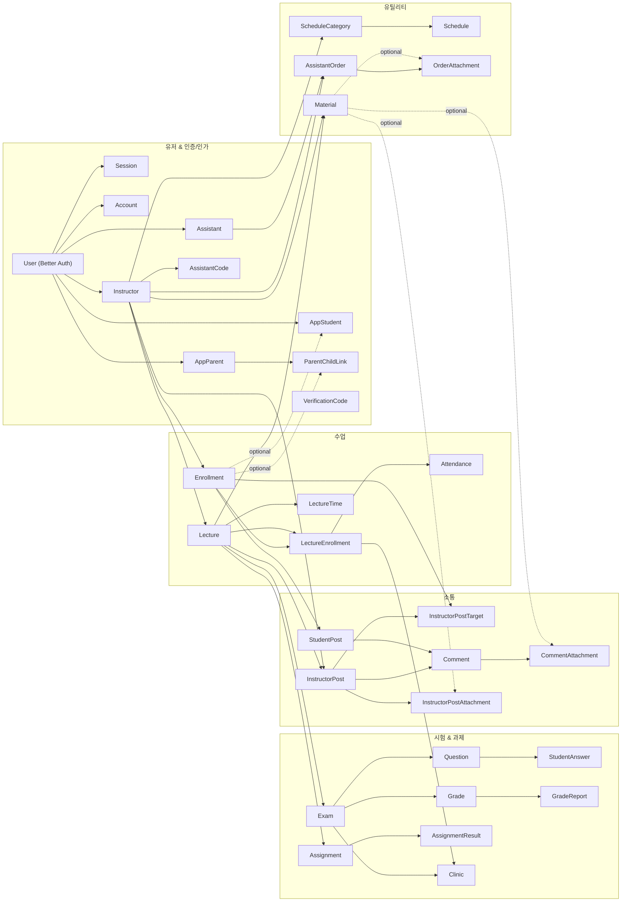
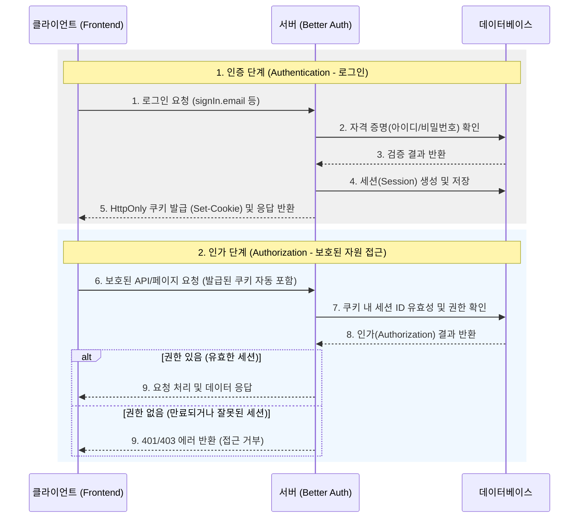

<div align="center">


# SSam B 백엔드

**학원/수업 운영을 위한 통합 플랫폼의 백엔드 서버**

Express 기반 REST API 서버로, 강사/조교/학생/학부모의 교육 운영 흐름을 하나의 API로 통합합니다.

|                                                                           프론트엔드                                                                            |                                                                            백엔드                                                                             |                                                              배포 링크                                                               |
| :-------------------------------------------------------------------------------------------------------------------------------------------------------------: | :-----------------------------------------------------------------------------------------------------------------------------------------------------------: | :----------------------------------------------------------------------------------------------------------------------------------: |
| [](https://github.com/EduOps-Lab/ssambee-fe) | [](https://github.com/EduOps-Lab/ssambee-be) | [](https://www.ssambee.com) |

</div>

## 📋 목차

- [SSam B 백엔드](#ssam-b-백엔드)
  - [📋 목차](#-목차)
  - [✨ 핵심 역할](#-핵심-역할)
  - [🛠 기술 스택](#-기술-스택)
  - [📁 프로젝트 및 API 구조](#-프로젝트-및-api-구조)
    - [폴더 구조](#폴더-구조)
    - [API 분류](#api-분류)
  - [🗄️ 데이터베이스 및 도메인](#️-데이터베이스-및-도메인)
  - [🔐 인증 및 인가 처리 플로우](#-인증-및-인가-처리-플로우)
    - [💡 트러블슈팅: 도메인 분리 환경에서의 세션 쿠키 유실 문제 해결](#-트러블슈팅-도메인-분리-환경에서의-세션-쿠키-유실-문제-해결)
  - [🚀 실행 및 배포](#-실행-및-배포)
    - [로컬 개발 및 실행](#로컬-개발-및-실행)
    - [서버 부팅 및 배포](#서버-부팅-및-배포)
  - [🛸 팀 소개](#-팀-소개)

---

## ✨ 핵심 역할

- **회원/권한/인증 관리:** Better Auth 기반의 세션 관리, 회원가입, 로그인 및 역할에 따른 API 접근 제어
- **수강 데이터 관리:** 강의, 수강생, 성적, 과제, 출결, 게시글, 일정 등의 교육 운영 데이터 중앙 관리
- **스토리지 연동:** 파일 업로드 및 정적 자료 제공을 위한 AWS S3 / CloudFront 연동
- **운영 확장성:** 라우트/서비스/리포지토리의 명확한 분리와 의존성 주입(DI)을 통한 유지보수성 및 확장성 확보
- **모니터링 연동:** Sentry, Nodemailer 등 알림/로그/모니터링 시스템 구축

---

## 🛠 기술 스택

| 분류         | 스택                                                                                                                                                                                                                                                                                                                                                                                                                                                                                                                                                                                                                                                                                                                                                                 |
| ------------ | -------------------------------------------------------------------------------------------------------------------------------------------------------------------------------------------------------------------------------------------------------------------------------------------------------------------------------------------------------------------------------------------------------------------------------------------------------------------------------------------------------------------------------------------------------------------------------------------------------------------------------------------------------------------------------------------------------------------------------------------------------------------- |
| **Backend**  |                                                                                                              |
| **Database** |                                                                                                                                                                                                                                                                                                                                                                                                                                                                                                                                                   |
| **Infra**    |        |

---

## 📁 프로젝트 및 API 구조

Express와 Prisma 기반의 3계층 아키텍쳐(Controller - Service - Repository)와 의존성 주입(DI) 패턴을 적용하여, 로직의 응집도를 높이고 교체 및 확장이 유리한 구조입니다.

### 폴더 구조

```text
src/
├── app.ts                  # 🚀 앱 부팅, 미들웨어, 라우팅 및 종료 제어
├── config/                 # ⚙️ 환경 변수, DB, Redis, Auth 구성
├── routes/                 # 🛤️ 엔드포인트 라우팅 (mgmt, admin, svc, public)
├── controllers/            # 🎮 HTTP 요청 및 응답 제어
├── services/               # 💼 비즈니스 로직
├── repos/                  # 🗄️ Prisma 기반 데이터 접근(Repository)
├── validations/            # ✅ Zod 기반 요청 데이터 검증
├── middlewares/            # 🛡️ 인증, 로깅, 에러 핸들링, 타이머 등 미들웨어
└── utils/                  # 🛠️ 공용 유틸리티 (메일, 모니터링, 날짜 등)
prisma/
└── schema.prisma           # 📝 DB 스키마 및 도메인 모델 정의
```

> **의존성 주입(DI):** 프레임워크 DI 컨테이너 없이도 라우터 팩토리, 서비스 생성자 기반으로 명시적 의존성을 주입합니다. 로직의 결합도를 낮춰 테스트가 쉬워지며, 기능 추가/수정 시 안정성을 보장합니다.

### API 분류

백엔드의 라우팅(`Base: /api/{domain}/v1`)은 크게 4가지 도메인으로 나뉩니다. 모든 서비스는 `GET /health` 경로를 통해 상태 체크를 지원합니다.

1. **`mgmt` (강사/조교 운영 API):**
   - 강사/조교가 사용하는 운영 기능을 묶음
   - 라우트: `/lectures`, `/enrollments`, `/exams`, `/assignment-results`, `/grades`, `/materials`, `/instructor-posts`, `/student-posts`, `/dashboard` 등
2. **`admin` (운영자 전용 API):**
   - 운영자가 사용하는 인증, 사용자 조회, 결제 운영 기능을 묶음
   - 라우트: `/auth`, `/admins`, `/users`, `/billing`
3. **`svc` (학생/학부모 서비스 API):**
   - 일반 사용자 관점의 서비스(조회, 제출 등)에 집중
   - 라우트: `/enrollments`, `/children`, `/grades`, `/clinics`, `/student-posts`, `/me`, `/uploads` 등
4. **`public` (공개 API):**
   - 비로그인 사용자의 접근 진입로
   - 라우트: `/auth`, `/billing`

---

## 🗄️ 데이터베이스 및 도메인

사용자 계층(`User`, `Instructor`, `Assistant`, `AppStudent`, `AppParent`)을 중심으로 운영 주체와 서비스 이용 주체가 명확하게 나뉩니다. 크게 5개의 비즈니스 도메인으로 관리됩니다.

<details>
<summary><strong>👉 데이터베이스 도메인 다이어그램 펼쳐보기</strong></summary>
<br>



</details>

<br>

| 도메인               | 구성 및 특징                                                        |
| -------------------- | ------------------------------------------------------------------- |
| **유저 & 인증/인가** | Better Auth 기본 모델 기반 사용자 식별. 플랫폼 전용 확장 메타 제공. |
| **수업 운영 계열**   | `Enrollment` ↔ `Lecture` ↔ `LectureEnrollment`/`Attendance`         |
| **시험 & 과제 계열** | 시험, 과제 평가 산출 및 리포트, 보완학습(`Clinic`)                  |
| **소통 계열**        | 공지, 질문 게시판(`InstructorPost`, `StudentPost`, `Comment`)       |
| **자원 및 유틸리티** | 자료함(`Material`), 일정(`Schedule`), 조교 업무 지시                |

---

## 💳 결제 플로우

- 무통장 결제 생성은 강사/조교 운영 API의 `POST /api/mgmt/v1/billing/payments/bank-transfer` 에서 처리합니다.
- 결제 생성 직후 상태는 `PENDING_DEPOSIT` 입니다.
- 강사는 아직 승인되지 않은 본인 무통장 결제를 `POST /api/mgmt/v1/billing/payments/:paymentId/cancel` 로 취소할 수 있습니다.
- 관리자 검수는 `POST /api/admin/v1/billing/payments/:id/approve` 또는 `POST /api/admin/v1/billing/payments/:id/reject` 로 바로 처리합니다.
- 별도의 입금 알림 엔드포인트 `POST /api/mgmt/v1/billing/payments/:paymentId/deposit` 는 더 이상 사용하지 않습니다.
- 현재 무통장 결제의 주요 상태 전이는 `PENDING_DEPOSIT -> APPROVED`, `PENDING_DEPOSIT -> REJECTED`, `PENDING_DEPOSIT -> CANCELED` 입니다.
- 무통장 결제 관련 메일은 결제 생성/승인/반려 처리 뒤 비동기 부수효과로 발송되며, API 응답은 SMTP 완료를 기다리지 않습니다.
- 입금 요청 메일은 `BANK_TRANSFER_ACCOUNT_BANK`, `BANK_TRANSFER_ACCOUNT_NUMBER`, `BANK_TRANSFER_ACCOUNT_HOLDER` 가 모두 설정된 경우에만 발송됩니다.
- 위 3개 계좌 환경변수는 앱 부팅 필수값은 아니며, 누락 시 서버는 계속 기동되고 입금 요청 메일만 경고 로그와 함께 스킵됩니다.
- 승인/반려 메일은 계좌 정보와 무관하게 SMTP 설정이 유효하면 계속 발송됩니다.

---

## 🔐 인증 및 인가 처리 플로우

<details>
<summary><strong>👉 인증 및 인가 처리 플로우 다이어그램 보기</strong></summary>
<br>



</details>

<br>

**보안 처리 흐름:**

1. 보호 라우트로 접근할 때 미들웨어 체인을 통과합니다.
2. `requireAuth`: 요청 헤더에서 세션을 조회해 유효하지 않으면 `401` 반환.
3. 유효한 세션은 `req.user`, `req.profile`, `req.authSession`에 안전하게 주입됩니다.
4. 권한 인가: 이후 `requireAdmin`, `requireInstructor`, `requireStudent` 등의 권한 미들웨어를 통해 사용자 타입을 검증합니다.
5. 특수 조건: 조교(`ASSISTANT`)의 경우 서명 승인(`signStatus === SIGNED`) 상태까지 확인하여 접근을 제한합니다.
6. 인프라 최적화: Better Auth를 활용해 크로스 도메인 쿠키(운영 환경), trust origin 설정(FRONT_URL 기반)으로 안전하게 동작합니다.

### 💡 트러블슈팅: 도메인 분리 환경에서의 세션 쿠키 유실 문제 해결

**문제(증상):** 프론트엔드(`www`)와 백엔드(`api`) 분리 환경에서, 로그인 시 `Set-Cookie`는 정상 발급되나 이후 보호된 라우트(세션 조회 등) 요청에 쿠키가 실리지 않아 세션 기반 라우팅에서 탈락(401)하는 증상이 발생했습니다.  
**원인:** Better Auth 쿠키가 단일 도메인 기준으로 동작하여 서브도메인 간 공유가 되지 않았고, 세션 조회 실패 시 즉각적으로 쿠키를 삭제하는 강한 로직이 맞물렸기 때문이었습니다.  
**해결방법:** `AUTH_COOKIE_DOMAIN` 환경변수와 `crossSubDomainCookies` 옵션을 활용하여 운영 환경 공통 도메인(`.ssambee.com`)을 기준으로 쿠키를 발급하도록 개선했습니다. 또한 로그아웃 등 세션 쿠키 삭제 시에도 도메인 정합성을 맞추어 다중 서브도메인 환경 전체에서 안정적으로 세션을 유지하도록 조치했습니다.

---

## 🚀 실행 및 배포

### 로컬 개발 및 실행

```bash
# 의존성 설치
$ pnpm install

# 로컬 개발 서버 실행
$ pnpm dev

# 빌드
$ pnpm build

# 운영 빌드 실행
$ pnpm start

# 테스트 실행
$ pnpm test
```

### 서버 부팅 및 배포

- **앱 부팅 흐름:** (1) 환경 변수 검증 → (2) Sentry 초기화 → (3) 보안/CORS 설정 → (4) 라우터 및 파싱 미들웨어 등록 → (5) 에러 핸들러 세팅 → (6) Graceful Shutdown
- **배포 아키텍쳐:** `docker-compose.yml` 기준으로 Nginx와 Blue/Green 무중단 배포를 지원합니다.
  - 컨테이너 종료(`SIGTERM`/`SIGINT`) 수신 시 라우팅을 중단하고 수신된 기존 요청 처리를 마친 뒤 DB 연결을 종료합니다.
- **인프라 선택적 연동:** `.env` 값을 기준으로 Sentry(에러 추적), Redis, AWS 연동은 제공된 환경변수가 있을 시에만 동작하도록 설계되었습니다.
- **무통장 메일 설정:** `BANK_TRANSFER_ACCOUNT_*` 값은 입금 요청 메일 전용 설정입니다. 운영에서 입금 요청 메일을 사용하려면 배포 환경에 3개 값을 모두 등록해야 합니다.

---

## 🛸 팀 소개

|                   👑 박창기                    |                    이유리                    |                          임경민                           |                     김윤기                      |
| :--------------------------------------------: | :------------------------------------------: | :-------------------------------------------------------: | :---------------------------------------------: |
|  |  |  |  |
|                  PM & 프론트                   |                    프론트                    |                          백엔드                           |                  백엔드 & 배포                  |

---

<div align="center">

**Made with ❤️ by SSam B Team**

</div>
